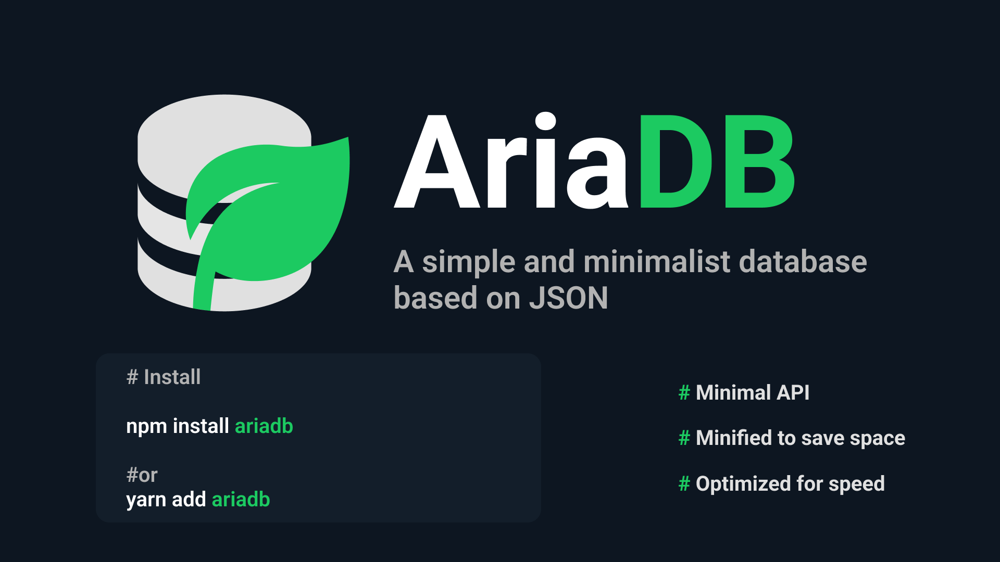

# AriaDB

AriaDB is a database manager based on a JSON file with a minimalist API with useful methods to manage information in a simple way.

## Features

- **Simple**: It is easy to use and understand.
- **Lightweight**: It is very lightweight and fast.
- **Secure**: It is secure and easy to use.
- **Powerful**: It is powerful and easy to use.
- **Open-source**: It is open-source and free to use.

## Installation

- Download the latest version of the source from [GitHub](https://gihub.com/carlos-burelo/AriaDB).

```bash
# install using npm
npm install ariadb

# install using yarn
yarn add ariadb
```

## Usage

To use AriaDB we simply need to create an instance of the AriaDB class which is exported by default from 'ariadb'

```javascript
// With ES5 syntax
const AriaDB = require('ariadb');
// With ES6 syntax
import AriaDB from 'ariadb';

// Create an instance of the AriaDB class
// and pass the path to the database file
const db = new AriaDB('path/to/database.json');

// and then we can use the methods
db.get('key'); // returns the value of the key
db.set('key', 'value'); // sets the value of the key
db.remove('key', { id: 1 }); // removes the key from arrays
db.delete('key'); // removes the key from objects and nested objects
db.push('key', { id: 1 }); // adds a new item to arrays
db.has('key'); // returns true if the key exists and false otherwise
db.query('key', ['id', 'name']); // returns keys from objects
db.toggle('key', true); // toggles the value of the key
// for nested objects and arrays use dot notation
db.toggle('key.nested.key', true);
```
